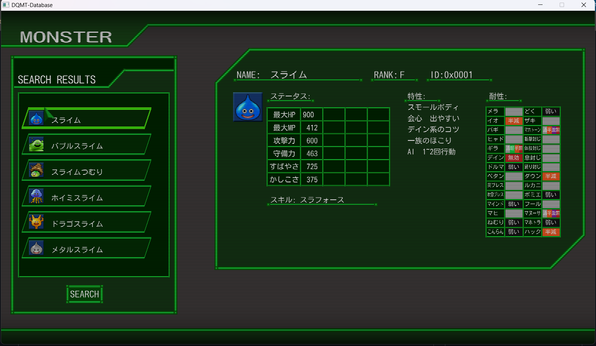
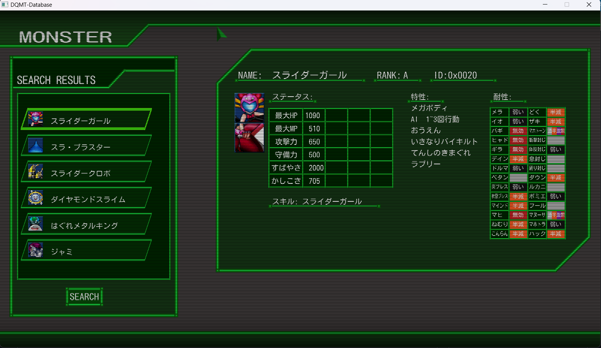
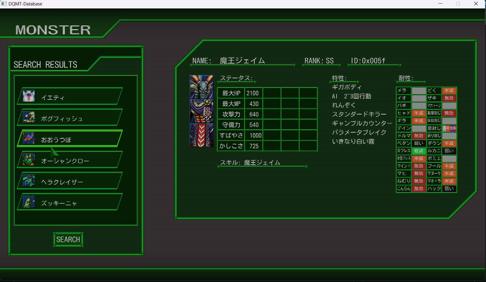

# DQMT-Database
This application is a database for monster in DQMT (Dragon Quest Monsters Terry's Wonderland 3D)
Select the monster from the left to see their stats in the main window.

# Screenshots




# Building
Setting up environment:
- Create folder named sdl2 in root directory (if using a different location, edit CMakeLists.txt accordingly).
- Download SDL2 to sdl2. Add C:/sdl2/bin to PATH environment variable.
- Download SDL2_image & SDL2_ttf. Copy header files to C:/sdl2/incldue. Do the same for binaries into C:/sdl2/bin and C:sdl2/lib.

Building:
Run the following batch scripts:
```
configure
build
```
Run by simply:
```
run
```
