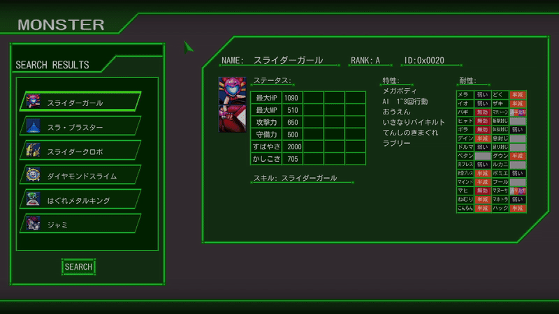

# DQMT-Database
This application is a database of all monsters in DQMT (Dragon Quest Monsters Terry's Wonderland 3D).


# How to Use
Select the monster you wish to see from the left window.
Scroll up or down the list using the mouse wheel.

# Building
Setting up environment:
- Create folder named sdl2 in root directory (if using a different location, edit CMakeLists.txt accordingly).
- Download SDL2 to sdl2. Add C:/sdl2/bin to PATH environment variable.
- Download SDL2_image & SDL2_ttf. Copy header files to C:/sdl2/incldue. Do the same for binaries into C:/sdl2/bin and C:sdl2/lib.

Building:
Run the following batch scripts:
```
configure
build
```
Run by simply:
```
run
```

# Technical
IMPORTANT: To use this software, you must first have a copy of the game. This is because the database is constructed using the raw ROM files of the game. If you have a dumped copy of the game, move the romfs folder into ROM/raw/. Upon running the program for the first time, it should construct the database from there and store it in data/.

The database is stored in a custom binary format that follows the data structure used by the program.

In the database are 4 sub-databases:
- Monsters (data/monsters.bin)
- Traits (data/traits.bin)
- Moves (data/moves.bin)
- Skills (data/skills.bin)

A custom graphics framework built upon SDL2 is used to handle rendering. (Located in: source/ui/framework)
A resource manager is used to provide a central hub for all loaded resoruces, and to manage memory.

The icons for the monsters are loaded directly from the dumped ROM. The icons are in a proprietary image format (.BCLIM files). The program parses and converts each .BCLIM file into a raw pixel buffer at run-time. The .BCLIM file structure/format is documented [here](https://github.com/sebeid4556/Documentation---DQMT-File-Formats/blob/main/Documentation%20-%20DQMT%20File%20Formats.pdf).

# Platforms
Currently only tested on Windows. SDL2 is cross-platform, so theoretically it should work on other systems as well.

# Screenshots


